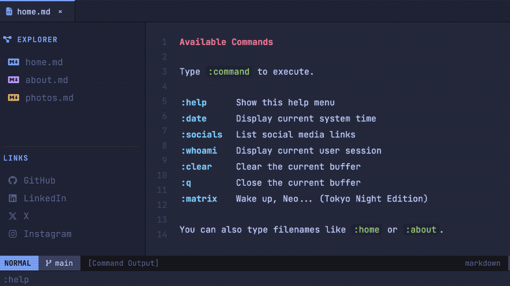

# vojay.io

Personal nvim style website. Visit [vojay.io](https://vojay.io).



## Adding a Blog Post

1. Create `posts/<date>-<slug>.md` with frontmatter:

```yaml
---
title: My Post Title
date: 2026-03-15
description: A short summary shown on the blog card.
image: images/blog/2026-03-15.jpg
tags:
  - python
  - data-engineering
---

Content...
```

2. Optionally add a cover image to `images/blog/` (cards hide gracefully if missing).

3. Regenerate the manifest and bust cache:

```bash
make posts
make bust
```

The blog page appears in the sidebar automatically once at least one post exists.
